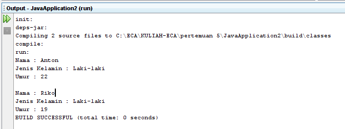

# Praktikum2


<p><b> Nama    :   Afra Nesya Apriyanthi </p>
<p><b> NIM     :   312110614 </p>
<p><b> Kelas   :   TI.21.C1 </p>
<p><b> Mata Kuliah : Pemrograman Orientasi Objek</p>
<p><b> Tugas Pertemuan 5 </p>


<p> Berikut soal dari latihan 1 <p>


berikut script javanya
Person.java

```java
public class Person {
    private String nama;
    private String jeniskelamin;
    private int umur;

    // setter
    public void setNama(String nama) {
        this.nama = nama;
    }
    
    public void setJenisKelamin(String jeniskelamin) {
        this.jeniskelamin = jeniskelamin;
    }

    public void setUmur(int umur) {
        this.umur = umur;        
    }

    // getter
    public String getNama() {
        return this.nama;
    }
    public String getJenisKelamin() {
        return this.jeniskelamin;
    }

    public int getUmur() {
        return this.umur;
    }
}
```

selanjutnya membuat java baru dengan nama LatihanPerson.java

```java
public class LatihanPerson{
    public static void main(String[] args)
    {
        // Membuat object
        Person a = new Person();    


    /* memanggil atribut dan memberi nilai */
    a.setNama("Anton");
    a.setJenisKelamin("Laki-laki");
    a.setUmur(22);
    System.out.println("Nama : " + a.getNama());
    System.out.println("Jenis Kelamin : " + a.getJenisKelamin());
    System.out.println("Umur : " + a.getUmur());

    System.out.println("      ");

    Person b = new Person();         

     b.setNama("Riko");
     b.setJenisKelamin("Laki-laki");
     b.setUmur(19);
     System.out.println("Nama : " + b.getNama());
     System.out.println("Jenis Kelamin : " + b.getJenisKelamin());
     System.out.println("Umur : " + b.getUmur());
    }
}
```

<p> Maka hasil outputnya adalah<p>


